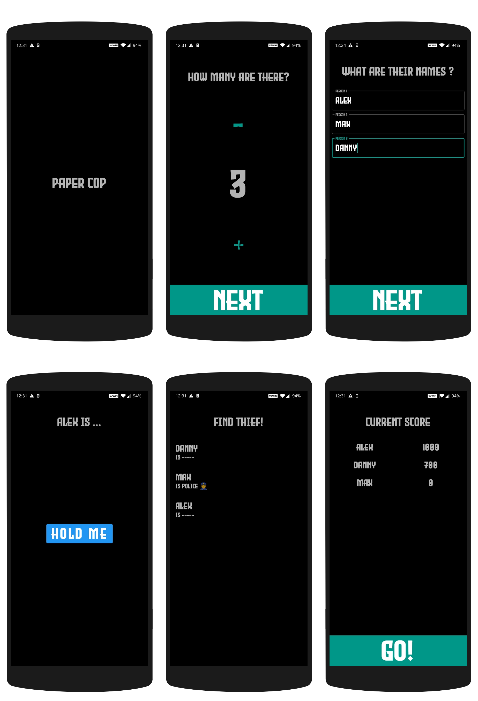

# Paper Cop 👮

The traditional "Kallanum Polisum" game android-ized.

> Save Paper 📖, Save Trees 🌲, Save the World! 🗺️ 😜

## Download 📥

- [Download APK](https://github.com/theapache64/paper-cop/releases/latest/download/app-release.apk)

## Screenshots 📱



## Files 📁

```
.
├── App.kt
├── core
│   └── Director.kt
├── data
│   ├── local
│   │   ├── entities
│   │   │   └── players
│   │   │       ├── PlayerEntity.kt
│   │   │       └── PlayersDao.kt
│   │   └── PaperCopDatabase.kt
│   └── repo
│       └── PlayersRepo.kt
├── di
│   └── modules
│       └── DatabaseModule.kt
├── feature
│   ├── base
│   │   ├── BaseActivity.kt
│   │   └── BaseViewModel.kt
│   ├── count
│   │   ├── CountActivity.kt
│   │   └── CountViewModel.kt
│   ├── find
│   │   ├── FindThiefActivity.kt
│   │   ├── FindThiefAdapter.kt
│   │   └── FindThiefViewModel.kt
│   ├── inputplayers
│   │   ├── InputPlayersActivity.kt
│   │   └── InputPlayersViewModel.kt
│   ├── pick
│   │   ├── PickActivity.kt
│   │   └── PickViewModel.kt
│   ├── players
│   │   ├── PlayersActivity.kt
│   │   ├── PlayersAdapter.kt
│   │   └── PlayersViewModel.kt
│   └── splash
│       ├── SplashActivity.kt
│       └── SplashViewModel.kt
├── model
│   └── Role.kt
├── utils
│   ├── extensions
│   │   ├── ContextExt.kt
│   │   └── SnackbarExt.kt
│   └── livedata
│       └── SingleLiveEvent.kt
└── widget
    └── PrimaryButton.kt

21 directories, 28 files
```

## Author ✍️

- theapache64